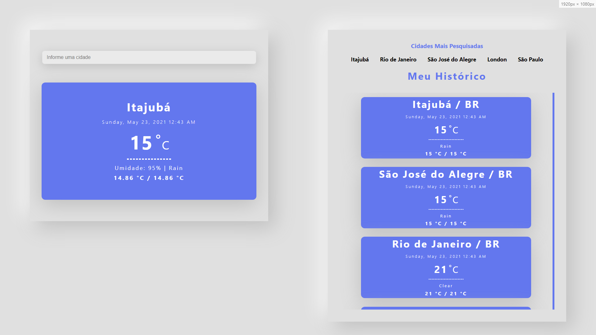

**Instalação em Ambiente local**

**Dependências:** 

- Postgresql - <https://www.postgresql.org/>
- pgAdmin - <https://www.pgadmin.org/>
- Node.js -  <https://nodejs.org/en/download/>
- Yarn - *npm i  -g yarn*
- Concurrently - *npm i -g concurrently*

**Banco de Dados (pgAdmin):** 

- Criar um banco de dados no postgres nomeado “teste”
- Clica com o botão direito do mouse em cima do banco e ir até restore (restaurar)
- Em format (Formato) deixar em Custom or tar (Cutomizado ou tar)
- Em Filename (nome do arquivo) selecionar o arquivo “dbBackup.backup” disponibilizado na raiz do projeto.
- Clicar Restore (Restaurar)

**Instalação:**

- Fazer o clone do projeto – *git clone [https://github.com/lLeo-sf/teste.git*](https://github.com/lLeo-sf/teste.git)*
- Abrir um terminar no caminho do projeto
- Entrar na pasta do projeto – *cd app*
- Instalar o projeto – *yarn install*
- O arquivo “connection.js” em “app/src/server/” contém as configurações de conexão com o banco de dados, alterar de acordo com o necessário 

**Execução:** 

- Execute *yarn start* na raiz do diretório ‘app/’

**Deploy (sem histórico):**
- [https://climaa.vercel.app/](https://climaa.vercel.app/)

